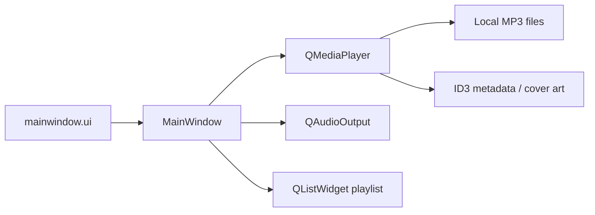

<div align="center">

# Music Player

### Offline desktop MP3 player built with Qt

[](https://isocpp.org/)
[](https://www.qt.io/)
[]()
[]()

<br/>

[]()
[]()
[]()
[]()

<br/>

[](https://github.com/hackerbotfz/C-music-player/commits)
[](https://github.com/hackerbotfz/C-music-player)
[](https://github.com/hackerbotfz/C-music-player/stargazers)

<br/>

**[Faiz Lawan](https://github.com/hackerbotfz)**

</div>

---

A native **Qt 6** desktop music player for local **MP3** libraries. Pick a folder, browse tracks in a playlist, and control playback with play/pause, seek, volume, mute, and automatic advance to the next track. Album art is read from file metadata with a bundled fallback cover.

## Overview

| Feature | Detail |
|---------|--------|
| **Library** | Load any directory of `.mp3` files via file menu |
| **Playback** | `QMediaPlayer` + `QAudioOutput` with position and duration sliders |
| **Controls** | Play/pause, seek to start, double-click seek for previous track, next track |
| **Volume** | Slider (0–100) and mute toggle with standard media icons |
| **Queue** | Auto-advance on track end; circular playlist navigation |
| **Artwork** | Embedded cover from ID3 tags, else default image from Qt resources |

## Architecture



Single-window app: **MainWindow** owns the media pipeline, playlist state (`QStringList` + `QDir`), and UI bindings defined in Qt Designer.

## Tech stack

C++17 · Qt Widgets · Qt Multimedia · qmake

## Run

Open `MusicPlayer.pro` in **Qt Creator**, configure the **Desktop** kit (MSVC or MinGW on Windows), then **Build → Run**.

Requires the **Qt Multimedia** module (`QT += multimedia`).

## Repository

```
Music_Player/
├── MusicPlayer.pro
├── resources.qrc
├── src/
│   ├── main.cpp
│   ├── mainwindow.cpp
│   ├── mainwindow.h
│   └── mainwindow.ui
├── assets/
│   └── default-cover.jpg
└── README.md
```

## License

© Faiz Lawan.
